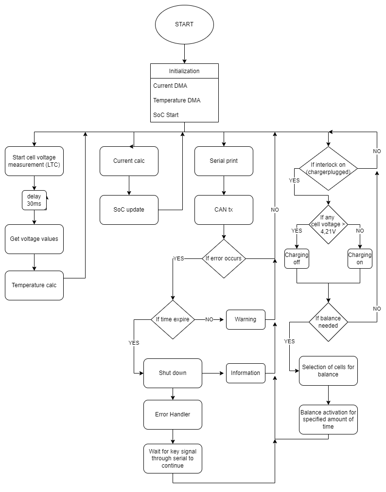

# PUTM_EV_BMS_LV_2022

## About
Battery Management System (BMS) is an electronic system that manages a rechargeable battery. In case of this project, it will be battery made of 21700 cells packed in 6S2P configuration.

## Tasks of Battery Management System:
- Voltage Measurement on every cell
- Current Measurement
- Temperature Measurement
- State of Charge calculate
- Charge Management with Cell Balance System
- Error Handling based on FSG Rules
- CAN - CAR communication
- Serial data print through USB

## Block diagram of the firmware

